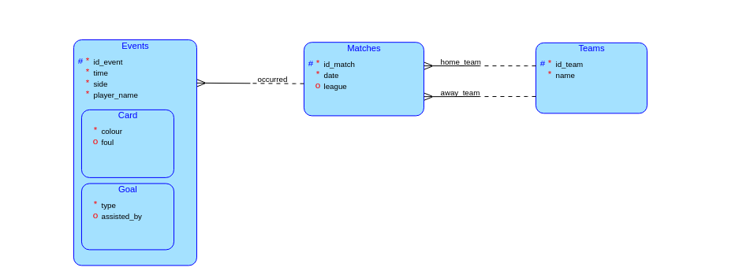

# Match Evidence
Livesport Intership task

## Database design


## Instructions (Linux)
**Database**
- install mysql and set *password* for root

```sudo apt install mysql-server```

- (if you don't know *password* for root, go to FAQ)
- run DB create script, fill in your *password*

```mysql -u root -p < create_script.sql```

- fill in your *password* in DB configuration file ```./db_connection.js``` on the line 6
- install JavaScript mysql library

```
sudo apt install npm
npm install express mysql2
```

**Match simulation**
- run script that simulates a match, can be run repeatedly

```node match_simulator.js```

**Statistics**
- to show basic info of all matches run this

```node show_matches.js```

- to show complete progress of specific match, run this and fill *match id*

```node show_match_by_id.js <id_match>```

## FAQ
**Password setting**
- launch mysql as root

```sudo mysql```

- set your new *password*

```
ALTER USER 'root'@'localhost' IDENTIFIED WITH mysql_native_password BY '<new_password>';
FLUSH PRIVILEGES;
EXIT;
```

- now continue in **Instructions**
